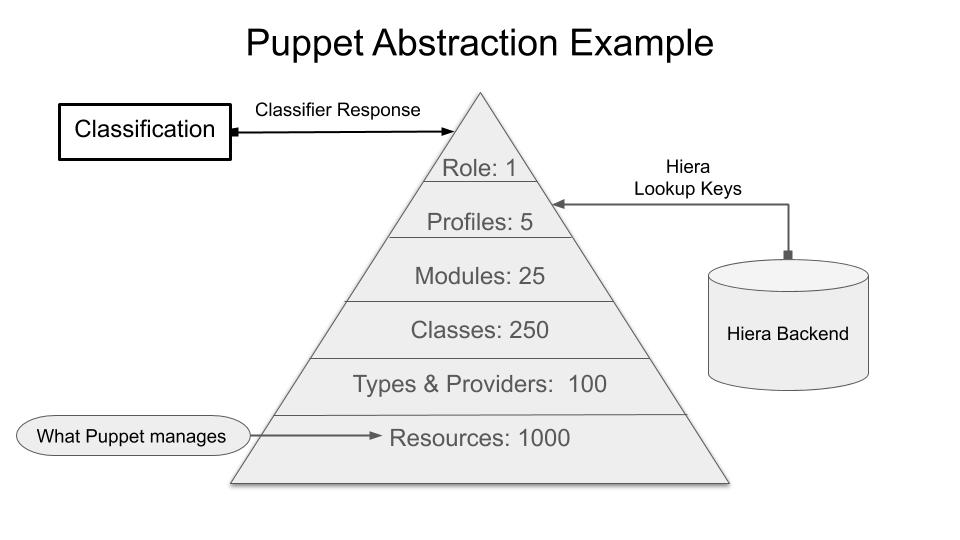

# A Puppet Demo Control Repository

* [What You Get From This control\-repo](#what-you-get-from-this-control-repo)
* [Copy This Repo Into Your Own Git Server](#copy-this-repo-into-your-own-git-server)


## What You Get From This Demo control-repo

This is a demo control repository that has working Roles (example\_role) and Profile (profile) code.  It is intended to demo what guidelines should be used to create roles and profiles, how they interact with other Puppet abastraction and explain some of the concepts behind the process.

The important files and items in this template are as follows:

* Basic example of roles (./site/example\_role) and profiles (./site/profile).
* An example Puppetfile (Puppetfile) with various module references.
* An example Hiera configuration file (heira.yaml) and data directory (data) with example yaml files, nodes, and roles directory.
* An [environment.conf](https://puppet.com/docs/puppet/5.3/config_file_environment.html) that implements:
  * A site directory for roles, profiles, and any custom modules for your organization.
  * A config\_version script.
* An example [config\_version](https://puppet.com/docs/puppet/5.3/config_file_environment.html#configversion) (./scripts/config_version.sh) script that outputs:
  * Hostname of the master the catalog was compiled on
  * Puppet Environment the catalog was compiled from
  * git commit ID of the code that was used during a Puppet run.
 
  **Example: `compiler01-development-3a9e6b2537b5f`**

Here's a visual representation of the structure of this repository:

```
.
|___ hiera.yaml                           # Hiera's configuration file. The Hiera hierarchy is defined here.
|___ LICENSE
|___ Puppetfile
|___ metadata.json
|___ spec                                 # This is the testing directory
|___ docs                                 # Addition info to assist in understaning
| |___ git_learning_materials.md
|___ README.md
|___ Rakefile
|___ environment.conf                     # Environment-specific settings. Configures the moduelpath and config_version.
|___ scripts
| |___ config_version.rb                  # A config_version script for r10k.
| |___ code_manager_config_version.rb     # A config_version script for Code Manager.
| |___ config_version.sh                  # A wrapper that chooses the appropriate config_version script.
|___ site                                 # This directory contains site-specific modules and is added to $modulepath.
| |___ README.md
| |___ profile                            # The profile module.
| | |___ README.md
| |___ example_role                       # The example_role module.
| | |___ README.md
|___ Gemfile                              # Gemfile to install required gems for testing
|___ keys                                 # Hiera Key directory
| |___ public_key.pkcs7.pem               # This can be distributed in production repo for developers to encrypt heira data
| |___ private_key.pkcs7.pem              # **THIS SHOULD BE REMOVED AND NEVER BE IN A CONTROL REPO** Only added for example purposes
|___ manifests
| |___ site.pp                            # The "main" manifest that contains a default node definition.
|___ data                                 # Hiera data directory.
| |___ role                               # Role-specific data goes here.
| |___ nodes                              # Node-specific data goes here.
| |___ to_be_deleted.yaml                 # **THIS FILE HAS DEMO VALUES AND SHOULD BE DELETED IF THIS REPO IS GOING TO BE USED**
| |___ virtual                            # Virtualization type data
| | |___ virtualbox.yaml
| |___ os                                 # OS family specific data
```

## Roles and Profiles Triangle

Bellow are the best practice guidelines used in the creation of this control-repo.

  - Role Guidelines
     - One role is assigned to a host.
     - Roles can be `classification-groups` in the PE console or classifier, or written in code as exampled here.
     - Roles only include profile classes.
     - Roles only have `include`'s and possibly ordering for the profiles.
     - Only one role is assined to a host agent.  If more than one role is required to build a host (agent) then a new role should be created for said agent.
     - Naming of Roles should be base on product or what the host (agent) will be providing for the company/organization. 
  - Profile layer is customer wrapper modules.
     - Profiles include component class.
     - Profiles should have little or no resource definitions.
     - Profiles can include other profiles.
     - Profiles should be named after the technoligy they are enforcing.
     - One base profile should be created supporting all organizationally suppored operating systems.  This profile should be the base configuration of the allowable organizational security and hardening configurations.
     - Profiles can be parameterized.
     - Profiles get data from hiera or through the classification tool (PE console).
  
  
